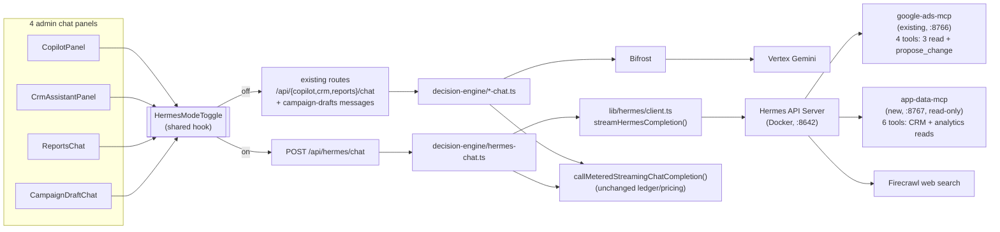

# Hermes Chat Integration — Design

**Date:** 2026-08-10
**Status:** Approved, pending implementation plan
**Depends on:** `docs/superpowers/plans/2026-08-10-hermes-agent-container-install.md` (Hermes container running locally, wired to `ads-agent`'s Google Ads MCP server, Vertex AI + Firecrawl configured — all 7 tasks completed and verified end-to-end)

## Problem

Hermes (the self-improving agent container installed in the prior plan) is only reachable via its own CLI/dashboard today. The request is to make it accessible **through all of `ads-agent`'s chat interfaces** in the admin app, not as a separate tool outside it.

## Scope

`ads-agent` has exactly four chat surfaces, all under the authenticated `(admin)` route group (admin/operator/viewer roles, never public):

| Surface | Route | Decision-engine module | Panel component |
|---|---|---|---|
| Copilot | `POST /api/copilot/chat` | `lib/decision-engine/copilot-chat.ts` | `components/copilot/CopilotPanel.tsx` |
| CRM Assistant | `POST /api/crm/chat` | `lib/decision-engine/crm-chat.ts` | `components/CrmAssistantPanel.tsx` |
| Reports Assistant | `POST /api/reports/chat` | `lib/decision-engine/reports-chat.ts` | `components/ReportsChat.tsx` |
| Campaign draft chat | `POST /api/campaign-drafts/[id]/messages` | `lib/decision-engine/campaign-chat.ts` | `components/CampaignDraftChat.tsx` / `components/campaign-draft-chat/AiSetupView.tsx` |

No chat interfaces exist outside `ads-agent` (the main marketing site and `auth-service` have none), so this spec is scoped entirely to these four.

**Explicitly out of scope for this spec** (say so if any should move in-scope): changes to Hermes' existing `propose_change` tool or its read-only Google Ads MCP tools; any new write/mutation MCP tools; auto-escalation from the existing four models into Hermes; any change to the four existing decision-engine files' default (non-Hermes) behavior or system prompts.

## Why this isn't a drop-in

All four existing chat surfaces share one shape: free text in, streamed through `callMeteredStreamingChatCompletion()` → Bifrost → Vertex Gemini, constrained by a system prompt to emit **OpenUI-lang** (`root = ComponentName(...)`) instead of prose — the model describes a UI, and a client-side `Renderer` + `toolProvider` executes `Query()`/`Mutation()` calls against `POST /api/openui/tools`. Every call debits the org's credit ledger via `MeteringContext`.

Hermes is architecturally different: it's a free-text, server-side agentic loop that resolves its own tool calls (via MCP) before returning a final answer. It doesn't know OpenUI-lang and shouldn't be forced into it. Mixing the two response shapes in one turn would be confusing, so Hermes is added as an explicit **mode**, not a blend.

**Security-critical constraint carried into every part of this design:** Hermes' OpenAI-compatible API server executes tool calls *on the host running it*. The full profile built in the prior plan includes `terminal`, `file`, `browser`, and `computer_use` — none of that may become reachable from a web chat box. The Hermes instance the app talks to must stay scoped to MCP tools only (Google Ads read/`propose_change` + the new CRM/analytics reads below); no terminal/file/browser/computer_use exposure, regardless of who can open the toggle.

## Decisions made during brainstorming

1. **Integration shape:** an explicit **"Ask Hermes" mode toggle** inside each of the four existing chat panels — not silent auto-escalation, not a fifth standalone page. Satisfies "accessible through all chat interfaces" literally.
2. **Deployment topology:** `ads-agent` has no production deployment yet. The intended future home is the **same GCP VM** (`asia-south1-a`) that already runs the main marketing site. Because Hermes would be co-located on that same host, `network_mode: host` behaves like normal Linux host networking there (unlike Docker Desktop on Mac) — `localhost` reachability works unchanged from local dev to that future deployment. The Hermes base URL/key are env-configured, never hardcoded, so no design change is needed when that move happens.
3. **Cost accounting:** Hermes usage **debits the same org credit ledger** as the other four surfaces, not a separate/unmetered path.
4. **MCP tool scope:** Hermes' MCP access is **expanded now**, not deferred — a new read-only MCP server exposes CRM and analytics tools so "Ask Hermes" is actually useful from every panel, not just ads/marketing ones.

## Architecture

## Components

### 1. New MCP server: `ads-agent/mcp/app-data-mcp-server/`

Mirrors `mcp/google-ads-server/index.ts`'s exact pattern — `McpServer` + `createMcpHandler` + host-header/origin validation (`APP_DATA_MCP_ALLOWED_HOSTS`, `APP_DATA_MCP_BIND`), its own port (8767 suggested). It wraps the **existing** tool functions verbatim — zero new business logic:

| MCP tool | Wraps | Source |
|---|---|---|
| `list_opportunities` | `crmToolProvider.list_opportunities` | `lib/openui/crm-tools.ts` |
| `search_opportunities` | `crmToolProvider.search_opportunities` | `lib/openui/crm-tools.ts` |
| `get_opportunity` | `crmToolProvider.get_opportunity` | `lib/openui/crm-tools.ts` |
| `get_spend_cpl_trend` | `analyticsToolProvider.get_spend_cpl_trend` | `lib/openui/analytics-tools.ts` |
| `list_campaigns_with_cpl` | `analyticsToolProvider.list_campaigns_with_cpl` | `lib/openui/analytics-tools.ts` |
| `list_pending_proposals` | `analyticsToolProvider.list_pending_proposals` | `lib/openui/analytics-tools.ts` |

`advance_opportunity_stage` (the one CRM mutation) is **not** exposed — mirrors the existing pattern where the only write path anywhere in Hermes' reach is `propose_change`. Added as a new service in `ads-agent/docker-compose.yml`, alongside the existing `google-ads-mcp` service.

### 2. Hermes-side config: `~/.hermes/config.yaml`

A second `mcp_servers` entry (`app_data`) pointing at `http://localhost:8767/mcp`, `tools.include` listing exactly the six tools above.

### 3. New streaming client: `ads-agent/lib/hermes/client.ts`

`streamHermesCompletion()` implements the same `StreamChatCompletionFn` interface (`lib/openui/streaming-types.ts`) that `streamChatCompletion()` (Bifrost) already implements: POSTs to `${HERMES_API_SERVER_URL}/v1/chat/completions` with `Authorization: Bearer ${HERMES_API_SERVER_KEY}`, `stream: true`, parses OpenAI-format SSE (`choices[0].delta.content` → `{type: "delta"}`, `usage` → `{type: "usage", model, usage: {promptTokens, completionTokens, totalTokens}}`). Because the shape matches exactly, it plugs straight into the existing `callMeteredStreamingChatCompletion()` with **no changes to `lib/metering/{pricing,ledger,metered-client}.ts`**. Hermes reports its model as `google/gemini-2.5-pro`; `normalizeModelName()` already strips the `google/` prefix and that rate already exists in `MODEL_PRICING`.

### 4. New decision-engine module: `ads-agent/lib/decision-engine/hermes-chat.ts`

Mirrors the shape of the other four (`isHermesConfigured()` pre-check, `MeteringContext` from session, error → friendly fallback string) but with a minimal system preamble — plain text only, no OpenUI-lang instructions. Exports `draftHermesReply({ history, userMessage, origin })`.

### 5. New shared route: `ads-agent/app/api/hermes/chat/route.ts`

`POST`, session-gated the same way the other four routes are. Body: `{ history, userMessage, origin: "copilot" | "crm" | "reports" | "campaign" }`. `origin` feeds the ledger `feature` tag (`ads-agent:hermes-chat:<origin>`) so spend stays attributable per surface through one shared endpoint instead of four near-identical ones.

### 6. New shared UI: `HermesModeToggle` + `useHermesMode`

A small toggle control + hook (e.g. `ads-agent/components/hermes/HermesModeToggle.tsx`), added to each of the four panel components. When on, that panel's send function POSTs to `/api/hermes/chat` (with its `origin`) instead of its own route. **No new rendering logic is needed** — `lib/openui/is-openui-lang.ts`'s `looksLikeOpenUiLang()` already bifurcates Renderer-vs-plain-text-bubble client-side, and Hermes' free text never matches that check, so it always renders as a normal prose bubble.

### 7. Deployment

`HERMES_API_SERVER_URL` (default `http://127.0.0.1:8642`) and `HERMES_API_SERVER_KEY` env vars in `ads-agent`. Hermes' `.env` gets `API_SERVER_ENABLED=true` (currently unset from the prior plan). When `ads-agent` is later deployed to the GCP VM alongside Hermes, the same env vars/URL keep working unmodified.

## Error handling

Same pattern as the existing four surfaces:
- `isHermesConfigured()` false → "Hermes isn't configured yet (set `HERMES_API_SERVER_URL`), ask an admin to set it."
- `InsufficientCreditsError` → the same shared "out of credits" reply used by the other four.
- Network/timeout to the Hermes API server → "Hermes is unavailable right now — try again shortly."
- MCP server unreachable from Hermes' side → surfaces as a normal tool-call failure inside Hermes' own agent loop (existing Hermes behavior, unchanged).

## Testing

- `lib/hermes/client.test.ts` — SSE parsing + usage-chunk mapping, mirroring `lib/openui/bifrost-stream.test.ts`'s existing shape.
- `mcp/app-data-mcp-server/index.test.ts` — build the server in-memory, call each of the 6 tools, assert delegation to `crmToolProvider`/`analyticsToolProvider`, mirroring `mcp/google-ads-server/index.test.ts`.
- `app/api/hermes/chat/route.test.ts` — mirroring `app/api/copilot/chat/route.test.ts` (auth gate, streaming, credit-exhaustion path).
- `lib/decision-engine/hermes-chat.test.ts` — mirroring the other four `*-chat.test.ts` files.

## Success criteria

- [ ] `app-data-mcp-server` running, exposing exactly the 6 read-only tools, added to `docker-compose.yml`.
- [ ] Hermes' `~/.hermes/config.yaml` has both `mcp_servers` entries; `hermes mcp list` shows both, tool counts matching the allowlists (4 for `ads_agent`, 6 for `app_data`) — no write tools selected on either.
- [ ] "Ask Hermes" toggle present and functional in all 4 panels (Copilot, CRM, Reports, Campaign draft).
- [ ] A Hermes turn from each of the 4 panels streams a plain-text reply (no OpenUI parse errors) and produces a `usage_ledger` row with `feature = ads-agent:hermes-chat:<origin>` matching the panel it was opened from.
- [ ] A CRM-domain question asked via "Ask Hermes" from the CRM panel resolves using the new `app_data` MCP tools (verified via Hermes tool-call logs), not just the Google Ads tools.
- [ ] No terminal/file/browser/computer_use tool is reachable through any app-facing Hermes call (verified via Hermes' `tools.include` allowlist on both MCP entries and the API-server profile's own tool config).
