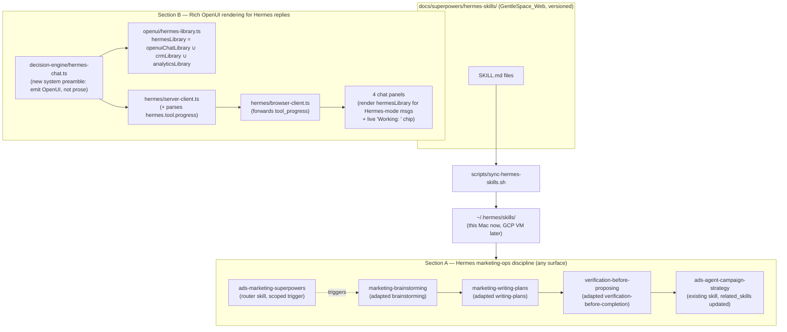

# Hermes Marketing-Ops Skills + Rich OpenUI Chat Rendering — Design

**Date:** 2026-08-10
**Status:** Approved, pending implementation plan
**Depends on:** `docs/superpowers/specs/2026-08-10-hermes-chat-integration-design.md` (Hermes reachable from all 4 `ads-agent` chat panels via an "Ask Hermes" toggle — implemented and verified end-to-end)

## Problem

Two gaps surfaced after the Hermes↔ads-agent chat integration shipped:

1. **No planning discipline.** Hermes can jump straight to a campaign recommendation or a `propose_change` call without clarifying intent, proposing alternatives, or double-checking its data — the behavior Cursor's `using-superpowers`/`brainstorming` skills enforce for code changes has no equivalent for Hermes' marketing/ops decisions, on any of its surfaces (Telegram, dashboard, cron, or the `ads-agent` chat panels).
2. **Wall-of-text chat.** Every non-Hermes chat surface in `ads-agent` renders rich OpenUI cards (`Renderer` + a component library); Hermes' replies render as plain prose bubbles. The rendering plumbing already works generically for Hermes messages too (`looksLikeOpenUiLang()` runs on every assistant message regardless of origin) — the only reason it never fires is that `lib/decision-engine/hermes-chat.ts`'s system preamble explicitly says *"never emit OpenUI-lang."*

## Scope

Two independent sub-projects, one spec, two implementation waves:

- **Section A — Hermes marketing-ops discipline.** Lives in `~/.hermes/skills/` (synced from a versioned copy in this repo). Affects Hermes on **every** surface, not just `ads-agent`.
- **Section B — Rich OpenUI rendering for Hermes replies.** Lives entirely in `ads-agent`'s Next.js codebase. Affects only Hermes-mode messages in the 4 existing chat panels.

**Explicitly out of scope** (say so if any should move in-scope):
- The full software-dev superpowers pack (`using-git-worktrees`, `requesting/receiving-code-review`, `finishing-a-development-branch`, `test-driven-development`, `dispatching-parallel-agents`, `executing-plans`, `subagent-driven-development`, `systematic-debugging`, `writing-skills`) — no code/git artifact exists in the marketing/CRM domain, and the `api_server` platform has no terminal/file/git access regardless.
- Broadening the skill trigger beyond marketing/ads/campaign/CRM topics (Hermes' general personal-assistant use — Telegram errands, home automation, unrelated coding sessions — is untouched).
- Any change to Hermes' MCP tool allowlists (`ads_agent`, `app_data`), its `terminal`/`file`/`browser`/`computer_use`/`code_execution` gating on `api_server`, or the four non-Hermes decision-engine files/libraries' existing behavior.
- Migrating the Hermes integration from `/v1/chat/completions` to `/v1/responses`.
- OpenUI Cloud (self-hosted `@openuidev/react-ui` components only).
- Streaming Hermes' background self-improvement loop or `subagent.*` run events into the chat UI.

## Decisions made during brainstorming

1. **Spec structure:** one document, two sections (this file), one implementation plan.
2. **Skill scope:** a focused subset — `using-superpowers` (router) + `brainstorming` + `writing-plans` + `verification-before-completion`, adapted for campaign/CRM/ads decisions — not the full 14-skill pack.
3. **Trigger scope:** marketing/ads/campaign/CRM topics only, on **any** Hermes surface (not scoped to just the `ads-agent` chat panels, and not broadened to all of Hermes' personal-assistant activity).
4. **Skill location:** versioned in `GentleSpace_Web` (this repo) with a sync script that copies into `~/.hermes/skills/` — reproducible for the future GCP VM move, unlike the existing unversioned `ads-agent-campaign-strategy` skill.
5. **Component library:** adopt `@openuidev/react-ui`'s `openuiChatLibrary` (official self-hosted pattern for "render only assistant responses in an existing chat app," per the `openui` skill) rather than hand-rolling new chat-generic components.
6. **Domain data:** merge `openuiChatLibrary` with the existing `crmLibrary` + `analyticsLibrary` component definitions so a Hermes answer about leads/spend looks identical to the same answer from the CRM/Reports panels.
7. **Tool-progress:** include Hermes' `hermes.tool.progress` SSE event as a live "Working: `<tool>`" indicator while streaming (not deferred).

## Architecture

## Section A — Hermes marketing-ops discipline

### A1. New skill files

All new files live at `docs/superpowers/hermes-skills/<category>/<name>/SKILL.md` in this repo (source of truth), synced into `~/.hermes/skills/<category>/<name>/SKILL.md`.

| New skill | Category | Adapted from | Trigger (description) |
|---|---|---|---|
| `ads-marketing-superpowers` | `ads-agent` | `using-superpowers` | Router. Fires whenever a request touches campaign strategy, ad spend, CRM pipeline decisions, or any materially uncertain marketing/ops question — not a universal trigger. |
| `marketing-brainstorming` | `ads-agent` | `brainstorming` | Before recommending a campaign change, budget change, or CRM action, or calling `propose_change`: ask clarifying questions one at a time, propose 2-3 options with trade-offs, get explicit user/human confirmation of direction before drafting the proposal. |
| `marketing-writing-plans` | `ads-agent` | `writing-plans` | Once a direction is confirmed: turn it into the concrete `propose_change` payload (one-paragraph summary + numbered, data-grounded recommendations) — the same shape `ads-agent-campaign-strategy` step ② already produces, now as its own reusable skill. |
| `verification-before-proposing` | `ads-agent` | `verification-before-completion` | Immediately before calling `propose_change`: re-verify every number/claim traces to an actual MCP tool result from this conversation; refuse to submit if any claim is unverified. |

Each file follows Hermes' repo-standard frontmatter shape (`name`, `description`, `version`, `author`, `license`, `platforms`, `metadata.hermes.{tags,category,related_skills}`) even though the personal-tier loader doesn't hard-enforce it — for consistency and in case any of these are later promoted to in-repo. `related_skills` link the four to each other and to `ads-agent-campaign-strategy`.

### A2. Update to the existing `ads-agent-campaign-strategy` skill

`~/.hermes/skills/ads-agent-campaign-strategy/SKILL.md` (source copy moved to `docs/superpowers/hermes-skills/ads-agent/ads-agent-campaign-strategy/SKILL.md` for the same versioning reason):
- `metadata.hermes.related_skills` gains `[ads-marketing-superpowers, marketing-brainstorming, marketing-writing-plans, verification-before-proposing]`.
- Step ① ("Gather data") gets one added line: after gathering data and before forming a recommendation (step ②), invoke `marketing-brainstorming` when the direction isn't obvious from the data alone.
- Step ③ ("Submit it") gets one added line: run `verification-before-proposing` immediately before the `propose_change` call.

### A3. Sync mechanism

`scripts/sync-hermes-skills.sh` (repo root): copies every `docs/superpowers/hermes-skills/<category>/<name>/` directory into `~/.hermes/skills/<category>/<name>/`, overwriting existing files (idempotent — safe to re-run). Prints a reminder that the current Hermes session won't see changes until a new session (per Hermes' own skill-loader caching behavior). The same script runs unmodified once Hermes is co-located on the GCP VM (`~/.hermes` is a fixed path regardless of host).

## Section B — Rich OpenUI rendering for Hermes

### B1. Dependency

Add `@openuidev/react-ui` to `ads-agent/package.json`. Import `@openuidev/react-ui/layered/styles/index.css` (cascade-layered, not the default unlayered stylesheet) once, to minimize collision with the app's existing Tailwind-based design tokens (`bg-surface`, `border-border`, etc. used throughout the hand-rolled libraries).

### B2. `hermesLibrary`

New file `ads-agent/lib/openui/hermes-library.ts`: composes `openuiChatLibrary`'s components with `crmLibrary`'s (`OpportunityCard`, `OpportunityList`, `StageChangeConfirm`) and `analyticsLibrary`'s (`TrendChart`, `DataTable`) component definitions into one `Library` via `createLibrary`. Exact merge call verified against installed `@openuidev/react-ui` exports at implementation time (per the `openui` skill's version-sensitivity rule) — if `openuiChatLibrary`'s internal components aren't individually exported, compose at the prompt level instead (concatenate `openuiChatLibrary.prompt()` + the domain components' specs) and document why in the task.

### B3. `lib/decision-engine/hermes-chat.ts`

Replace `SYSTEM_PREAMBLE`'s *"Reply in plain prose — never emit OpenUI-lang"* with `hermesLibrary`-generated instructions (`hermesLibrary.prompt(...)`), plus an explicit added rule: Hermes must emit **fully-resolved, static** OpenUI Lang — no `Query()`/`Mutation()` — because it already resolved its own MCP tool calls server-side before replying, unlike the other four surfaces which execute `Query`/`Mutation` client-side.

### B4. Streaming tool-progress

- `ads-agent/lib/openui/streaming-types.ts`: add a `{ type: "tool_progress"; tool: string }` member to `StreamChunk`.
- `ads-agent/lib/hermes/server-client.ts`: parse `event: hermes.tool.progress` SSE frames (distinct from the existing bare `data:` chat-completion-chunk frames) and yield the new chunk type. `callMeteredStreamingChatCompletion` (unmodified) already passes through unknown-to-it chunk types to its caller.
- `ads-agent/lib/decision-engine/hermes-chat.ts`: forward `tool_progress` chunks as a new `HermesChatTurnEvent` variant (`{ type: "tool_progress"; tool: string }`).
- `ads-agent/lib/hermes/browser-client.ts`: forward the same event shape over the browser SSE stream.
- All 4 panels: track the latest `tool_progress` value in state, render it as a small "Working: `<tool>`" chip above the streaming bubble; clear it on the next `delta` or `done` event.

### B5. Panel rendering changes

Each panel already renders Hermes messages generically via `looksLikeOpenUiLang()` + `Renderer`. The only change per panel: pass `hermesLibrary` (not the panel's own domain library) as `library`, and no `toolProvider`, specifically for messages where `hermesMode` was active — a stricter parse-then-render guard (below) replaces today's parse-inside-`Renderer` behavior for Hermes messages only.

### B6. Robustness: stricter parse guard for Hermes messages

Hermes is free-form and not fine-tuned on OpenUI Lang, so malformed syntax is more likely than from the four constrained domain models. Before rendering a Hermes message with `Renderer`, validate first with `createParser(hermesLibrary.toJSONSchema(), "Card").parse(response)` and check `result.meta.errors` is empty. If there are errors, render the raw text bubble for that turn instead of handing a broken response to `Renderer`. (The four non-Hermes surfaces are unaffected — they keep today's `looksLikeOpenUiLang` + direct-`Renderer` behavior.)

### B7. Unaffected

Metering (`callMeteredStreamingChatCompletion`, `pricing.ts`, `ledger.ts` — still only `usage` chunks feed the ledger), MCP tool allowlists, the other four surfaces' existing libraries and non-Hermes behavior.

## Error handling

- Hermes OpenUI parse failure → falls back to plain-text bubble for that turn (B6), never a broken/partial render.
- `@openuidev/react-ui` CSS not imported / build issue → caught by the existing Next.js build check; documented as a manual verification step in the plan.
- Skill sync script not yet run on a given Hermes install (e.g., before the first GCP VM deploy) → the skill is simply absent from Hermes' index; no error, graceful degradation to today's behavior.
- `hermes.tool.progress` absent (older Hermes version, or a turn with no tool calls) → the "Working" chip never appears; no error.

## Testing

- **Section A:** no automated tests (personal skill files, not application code). Manual verification: ask Hermes a campaign-strategy question via any surface (Telegram or the `ads-agent` Hermes toggle), confirm `skill_view(name='ads-marketing-superpowers')` appears in Hermes' tool-call transcript/logs before it answers.
- **Section B:**
  - `ads-agent/lib/openui/hermes-library.test.ts` — asserts the merged library's component list has no name collisions and includes the expected domain components.
  - `ads-agent/lib/decision-engine/hermes-chat.test.ts` — updated: new preamble contains OpenUI instructions, no longer contains "never emit."
  - `ads-agent/lib/hermes/server-client.test.ts` — new case: `hermes.tool.progress` SSE frame → `{type: "tool_progress", tool}` chunk.
  - `ads-agent/lib/hermes/browser-client.test.ts` — forwards `tool_progress` events unchanged.
  - Manual end-to-end across all 4 Hermes-mode panels: a CRM-lead question (renders `OpportunityCard`/`OpportunityList`), a spend/CPL question (renders `TrendChart`/`DataTable`), an image-generation request (renders an image), a plain conversational question (renders via `openuiChatLibrary`'s prose/callout components, not a wall of text), and a follow-up-suggestion click (round-trips via `@ToAssistant`).

## Success criteria

- [ ] `docs/superpowers/hermes-skills/ads-agent/{ads-marketing-superpowers,marketing-brainstorming,marketing-writing-plans,verification-before-proposing}/SKILL.md` exist, versioned in this repo, valid frontmatter.
- [ ] `ads-agent-campaign-strategy`'s source copy is versioned in this repo too, with `related_skills` and procedure updates applied.
- [ ] `scripts/sync-hermes-skills.sh` successfully copies all 5 skills into `~/.hermes/skills/`; a fresh Hermes session's `skills_list` shows all 5.
- [ ] A campaign-strategy question asked of Hermes (any surface) triggers `skill_view` on `ads-marketing-superpowers` before Hermes answers.
- [ ] `@openuidev/react-ui` installed; `hermesLibrary` composes without name collisions.
- [ ] A Hermes reply from any of the 4 panels renders as OpenUI cards (not a plain-text bubble) for data-bearing questions, and renders via `openuiChatLibrary`'s prose/callout blocks (not a wall of text, but also not a hard parse error) for purely conversational questions.
- [ ] A Hermes reply about CRM leads/spend renders the same `OpportunityCard`/`TrendChart`/etc. components the non-Hermes CRM/Reports panels use for equivalent data.
- [ ] An image-generation request through "Ask Hermes" renders an actual image, not a markdown link/wall of text.
- [ ] The "Working: `<tool>`" indicator appears and clears correctly during a multi-tool-call Hermes turn.
- [ ] A deliberately malformed/edge-case Hermes reply falls back to a plain-text bubble instead of a broken render.
- [ ] No regression to the other four (non-Hermes) chat surfaces' existing rendering or metering behavior.
